# Relatório CIFAR-10

## Autores: Gabriel de Sousa e Suellen Oliveira

### Classes

```python
classes = {
    "airplane": 0,
    "automobile": 1,
    "bird": 2,
    "cat": 3,
    "deer": 4,
    "dog": 5,
    "frog": 6,
    "horse": 7,
    "ship": 8,
    "truck": 9,
}
```

### Modelo Inicial: lenet_5

```python
def CNN_model(input_shape=(32, 32, 3), num_classes=10):
  model = Sequential()
  model.add(Conv2D(6, kernel_size=(5, 5), activation='tanh', input_shape=input_shape))
  model.add(AvgPool2D(pool_size=(2, 2), strides=(2, 2)))
  model.add(Conv2D(16, kernel_size=(5, 5), activation='tanh'))
  model.add(AvgPool2D(pool_size=(2, 2), strides=(2, 2)))
  model.add(Conv2D(120, kernel_size=(5, 5), activation='tanh'))

  model.add(Flatten())
  model.add(Dense(84, activation='tanh'))
  model.add(Dense(num_classes, activation='softmax'))

  model.compile(loss='categorical_crossentropy', optimizer='adam', metrics=['accuracy'])
  return model
```

## Curva de Aprendizado
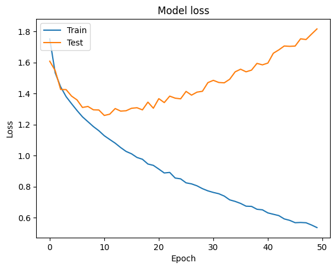

## Matriz de Confusão
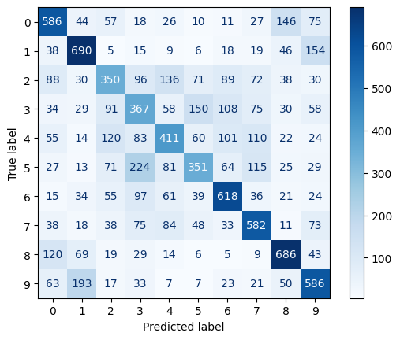

## F1-score, Recall e Precision
> Recall:  0.5227

> Precision:  0.5167

> F1 Score:  0.5197

## Curva ROC (com a AUC)
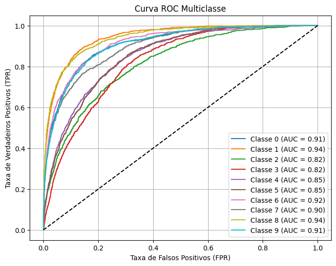

### Modelo melhorado 01: Implementando Dropout

```python
def model1(input_shape=(32, 32, 3), num_classes=10):
  model = Sequential()
  model.add(Conv2D(6, kernel_size=(5, 5), activation='tanh', input_shape=input_shape))
  model.add(AvgPool2D(pool_size=(2, 2), strides=(2, 2)))
  model.add(Dropout(0.25))

  model.add(Conv2D(16, kernel_size=(5, 5), activation='tanh'))
  model.add(AvgPool2D(pool_size=(2, 2), strides=(2, 2)))
  model.add(Conv2D(120, kernel_size=(5, 5), activation='tanh'))
  model.add(Dropout(0.25))

  model.add(Flatten())
  model.add(Dense(84, activation='tanh'))
  model.add(Dense(num_classes, activation='softmax'))

  model.compile(loss='categorical_crossentropy', optimizer='adam', metrics=['accuracy'])
  return model
```

## Curva de Aprendizado
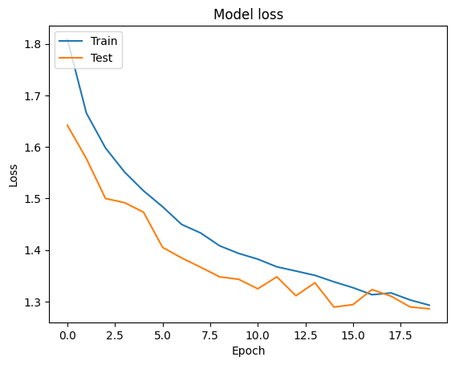

## Matriz de Confusão
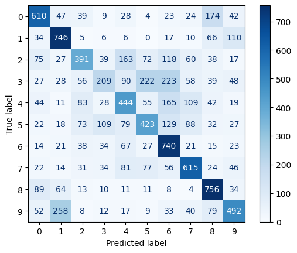

## F1-score, Recall e Precision
> Recall:  0.5426

> Precision:  0.5356

> F1 Score:  0.5391

## Curva ROC (com a AUC)
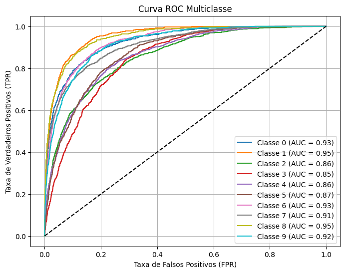


### Modelo melhorado 02: Mudando alguns parâmetros

```python
def model2(input_shape=(32, 32, 3), num_classes=10):
  model = Sequential()
  model.add(Conv2D(64, kernel_size=(3, 3), activation='tanh', input_shape=input_shape))
  model.add(Conv2D(64, kernel_size=(3, 3), activation='tanh', input_shape=input_shape))
  model.add(MaxPool2D(pool_size=(2, 2)))
  model.add(Dropout(0.4))

  model.add(Conv2D(128, kernel_size=(3, 3), activation='tanh'))
  model.add(Conv2D(128, kernel_size=(3, 3), activation='tanh'))
  model.add(MaxPool2D(pool_size=(2, 2)))
  model.add(Dropout(0.4))

  model.add(Flatten())
  model.add(Dense(1024, activation='tanh'))
  model.add(Dense(1024, activation='tanh'))
  model.add(Dense(num_classes, activation='softmax'))

  model.compile(loss='categorical_crossentropy', optimizer='adam', metrics=['accuracy'])
  return model
```

## Curva de Aprendizado
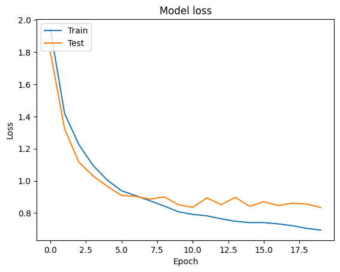

## Matriz de Confusão
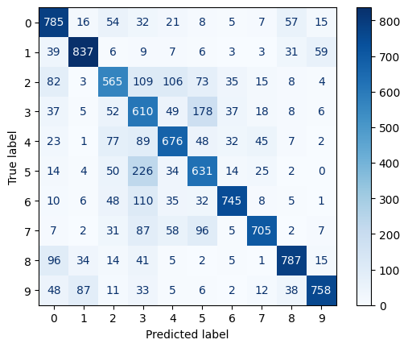

## F1-score, Recall e Precision
> Recall:  0.7099

> Precision:  0.7258

> F1 Score:  0.7177

## Curva ROC (com a AUC)
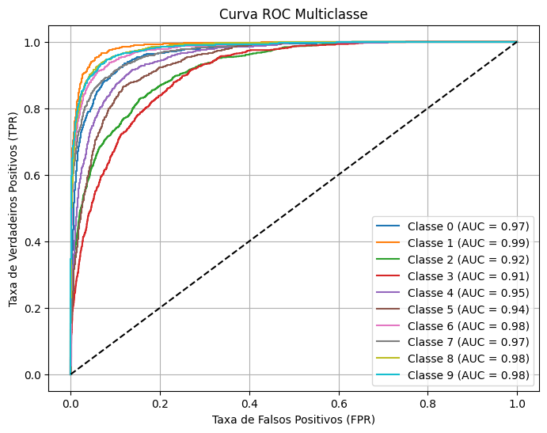

### Modelo melhorado 03: Adicionando camadas e ajustando parâmetros

```python
def model3(input_shape=(32, 32, 3), num_classes=10):
  model = Sequential()
  model.add(Conv2D(32, kernel_size=(3, 3), activation='tanh', kernel_initializer="he_uniform", padding="same", input_shape=input_shape))
  model.add(Conv2D(32, kernel_size=(3, 3), activation='tanh', kernel_initializer="he_uniform", padding="same"))
  model.add(MaxPool2D(pool_size=(2, 2)))
  model.add(Dropout(0.2))

  model.add(Conv2D(64, kernel_size=(3, 3), activation='tanh', kernel_initializer="he_uniform", padding="same"))
  model.add(Conv2D(64, kernel_size=(3, 3), activation='tanh', kernel_initializer="he_uniform", padding="same"))
  model.add(MaxPool2D(pool_size=(2, 2)))
  model.add(Dropout(0.3))

  model.add(Conv2D(128, kernel_size=(3, 3), activation='tanh', kernel_initializer="he_uniform", padding="same"))
  model.add(Conv2D(128, kernel_size=(3, 3), activation='tanh', kernel_initializer="he_uniform", padding="same"))
  model.add(MaxPool2D(pool_size=(2, 2)))
  model.add(Dropout(0.4))

  model.add(Flatten())
  model.add(Dense(128, activation='tanh', kernel_initializer="he_uniform"))
  model.add(Dropout(0.5))
  model.add(Dense(num_classes, activation='softmax'))

  model.compile(loss='categorical_crossentropy', optimizer='adam', metrics=['accuracy'])
  return model
```

## Curva de Aprendizado
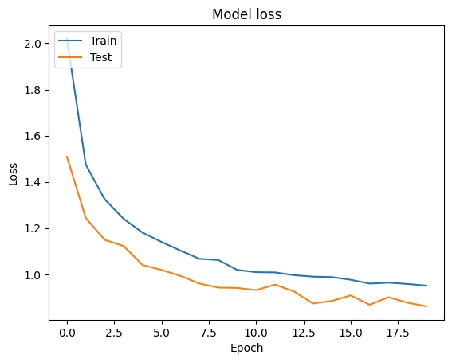

## Matriz de Confusão
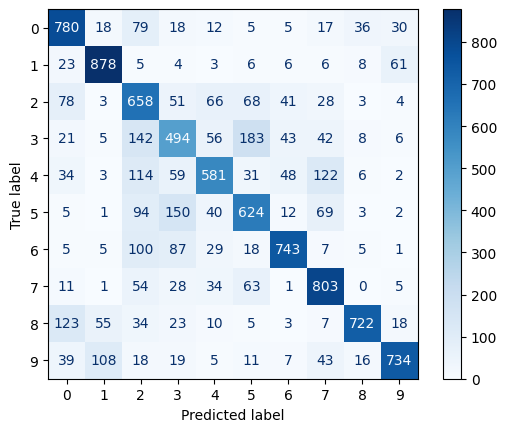

## F1-score, Recall e Precision
> Recall:  0.7017

> Precision:  0.7123

> F1 Score:  0.7069

## Curva ROC (com a AUC)
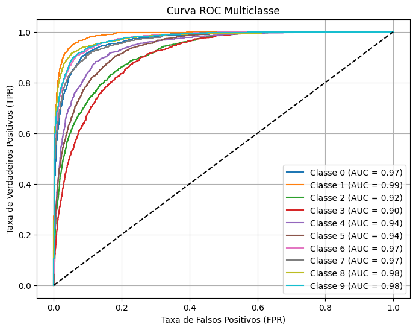

### Modelo melhorado 04: Adicionando BatchNormalization e usando RELU como ativação

```python
def model4(input_shape=(32, 32, 3), num_classes=10):
  model = Sequential()
  model.add(Conv2D(32, kernel_size=(3, 3), activation='relu', kernel_initializer="he_uniform", padding="same", input_shape=input_shape))
  model.add(BatchNormalization())
  model.add(Conv2D(32, kernel_size=(3, 3), activation='relu', kernel_initializer="he_uniform", padding="same"))
  model.add(BatchNormalization())
  model.add(MaxPool2D(pool_size=(2, 2)))
  model.add(Dropout(0.2))

  model.add(Conv2D(64, kernel_size=(3, 3), activation='relu', kernel_initializer="he_uniform", padding="same"))
  model.add(BatchNormalization())
  model.add(Conv2D(64, kernel_size=(3, 3), activation='relu', kernel_initializer="he_uniform", padding="same"))
  model.add(BatchNormalization())
  model.add(BatchNormalization())
  model.add(Conv2D(64, kernel_size=(3, 3), activation='relu', kernel_initializer="he_uniform", padding="same"))
  model.add(BatchNormalization())
  model.add(MaxPool2D(pool_size=(2, 2)))
  model.add(Dropout(0.3))

  model.add(Conv2D(128, kernel_size=(3, 3), activation='relu', kernel_initializer="he_uniform", padding="same"))
  model.add(BatchNormalization())
  model.add(Conv2D(128, kernel_size=(3, 3), activation='relu', kernel_initializer="he_uniform", padding="same"))
  model.add(BatchNormalization())
  model.add(MaxPool2D(pool_size=(2, 2)))
  model.add(Dropout(0.4))

  model.add(Flatten())
  model.add(Dense(128, activation='relu', kernel_initializer="he_uniform"))
  model.add(BatchNormalization())
  model.add(Dropout(0.5))
  model.add(Dense(num_classes, activation='softmax'))

  model.compile(loss='categorical_crossentropy', optimizer='adam', metrics=['accuracy'])
  return model
```

## Curva de Aprendizado
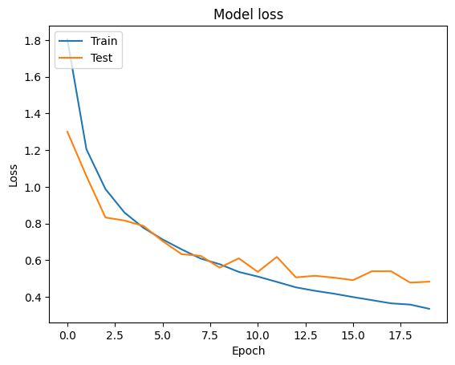

## Matriz de Confusão
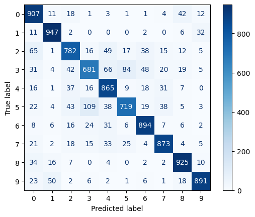

## F1-score, Recall e Precision
> Recall:  0.8484

> Precision:  0.8482

> F1 Score:  0.8483

## Curva ROC (com a AUC)
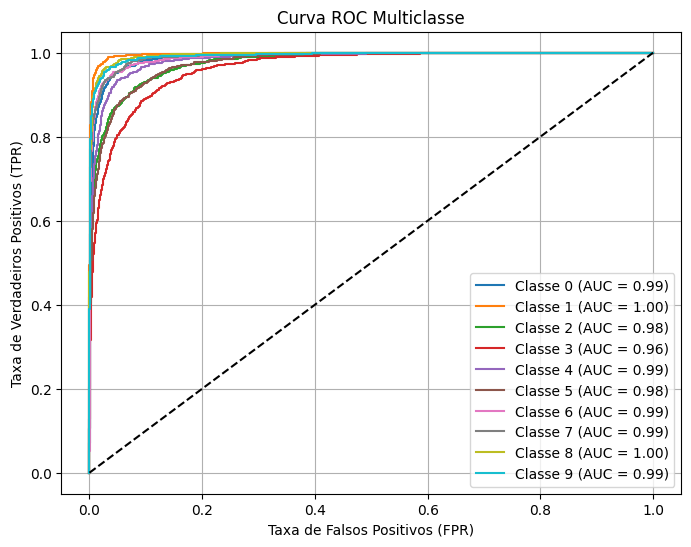

### Modelo melhorado 05: Adicionando Data-Augmentation

```python
def data_augmentation(X_train, y_train, batch_size=32):
  from tensorflow.keras.preprocessing.image import ImageDataGenerator

  train_datagen = ImageDataGenerator(width_shift_range=0.1,
                                     height_shift_range=0.1,
                                     horizontal_flip=True,
                                     rotation_range=20)

  return train_datagen.flow(X_train, y_train)
```

## Curva de Aprendizado


## Matriz de Confusão


## F1-score, Recall e Precision
> Recall:  0.8764

> Precision:  0.8783

> F1 Score:  0.8773

## Curva ROC (com a AUC)


### Análise dos resultados

O modelo lenet 5 teve um resultado bem ruim, na questão de treinamento ele foi melhorando ao passar das épocas porém o teste foi piorando. Nesse modelo embora ele tenha acertado quase 50% de cada classe, para as classes pássaro, gato e cachorro foi obtido valores baixos de acerto.

Do modelo lenet 5 para o modelo melhorado 01, foi implementado 2 dropout de valores 0.25, o que melhorou muito a curva de aprendizado onde o treino e o teste foi caminhando junto. Pássaro, gato e cachorro continuaram a ser as classes menos acertadas.

Do modelo 01 para o modelo 02, foi mudado alguns parâmetros como por exemplo o doprout e Average Pooling para Max Pooling além de adicionar mais uma camada de Convolução e 1024 neurônios depois da camada de Flatten. Na cruva de aprendizado começou bem mas ao passar das épocas, a linha de treino e teste foram se afastando. Já em questão de acertos melhorou com todas classes acertando mais de 50%, porém as mesmas 3 classes continuaram sendo as piores.

Do modelo 02 para o modelo 03, foi ajustado valor do dropout, números de neurônios além de adicionar o padding e kernel initializer. A curva de aprendizado apesar de não se encontrarem foram pararelas durante todo treinamento, analisando a matriz confusão é possível ver que algumas classes melhoraram, enquanto o acerto para outras pioraram.

Do modelo 03 para o modelo 04, foram adicionadas camadas e Batch Normalization além de ter mudado a função de ativação de tanh para relu. Na curva de aprendizado começou bem mas ao passar das épocas, a linha de treino e teste foram se afastando. Porém os acertos para cada classe aumentaram significativamente.

Do modelo 04 para o modelo 05, foi adicionado Data-Augmentation. Foi preciso treinar durante mais épocas alcançando resultados bem melhores e analisando a curva de aprendizado da de se esperar que ao treinar mais épocas talvez o modelo melhore um pouco mais.

Concluindo o melhor modelo alcançado nesse laboratório do CIFAR-10 foi o modelo 05, com os seguintes resultados: 
* Recall: 0.8764

* Precision: 0.8783

* F1 Score: 0.8773
