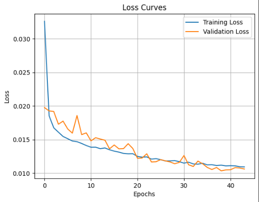
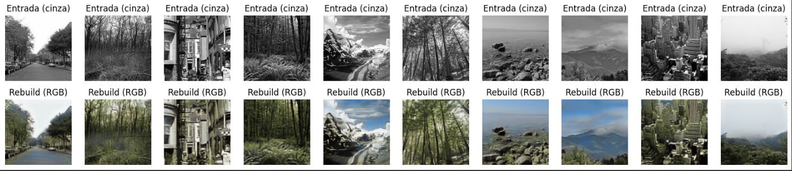

# Relatório de Experimentos: Autoencoder para Colorização de Imagens em Preto e Branco

## Introdução

Após o estudo inicial sobre autoencoders, surgiu a duvida sobre a possibilidade de utilizar essa técnica para colorização de imagens em preto e branco. O objetivo deste trabalho é apartir de uma estrutura inicial de autoencoder, explorar diferentes arquiteturas para melhorar a qualidade da colorização.

## Descrição da Base de Dados

- **Origem:** https://www.kaggle.com/datasets/theblackmamba31/landscape-image-colorization
- **Número de instâncias:** 7129 imagens coloridas e 7129 imagens em preto e branco
- **Formato das imagens:** 150x150
- **Partição dos dados:** 70% treinamento, 30% validação

## Pré-processamento dos Dados

- Normalização entre [0, 1];
- Redimensionamento para o tamanho 128x128;

## Arquitetura do Modelo Base

O modelo base utiliza uma arquitetura de autoencoder convolucional, com as seguintes características:

```python
def build_autoencoder(input_shape=(150, 150, 3)):
    input_img = Input(shape=input_shape)

    # Encoder
    x = Conv2D(32, (3, 3), activation='relu', padding='same')(input_img)
    x = MaxPooling2D((2, 2), padding='same')(x)
    x = Dropout(0.1)(x)

    x = Conv2D(64, (3, 3), activation='relu', padding='same')(x)
    x = MaxPooling2D((2, 2), padding='same')(x)
    x = Dropout(0.1)(x)

    encoded = Conv2D(128, (3, 3), activation='relu', padding='same')(x)

    # Decoder
    x = Conv2D(64, (3, 3), activation='relu', padding='same')(encoded)
    x = UpSampling2D((2, 2))(x)

    x = Conv2D(32, (3, 3), activation='relu', padding='same')(x)
    x = UpSampling2D((2, 2))(x)

    x = Cropping2D(((1, 1), (1, 1)))(x)

    decoded = Conv2D(3, (3, 3), activation='sigmoid', padding='same')(x)

    return Model(input_img, decoded)
```

## Experimentos Realizados

### Experimento 1
- **Arquitetura:** Base
- **Resultados:**






| Época | Acurácia | F1-score | Loss |
|-------|----------|----------|------|
| <!-- Preencha --> | <!-- Preencha --> | <!-- Preencha --> | <!-- Preencha --> |

- **Análise:**  
  <!-- Preencha aqui -->

---

### Experimento 2
- **Descrição:** <!-- Preencha aqui -->
- **Objetivo:** <!-- Preencha aqui -->
- **Resultados:**

| Época | Acurácia | F1-score | Loss |
|-------|----------|----------|------|
| <!-- Preencha --> | <!-- Preencha --> | <!-- Preencha --> | <!-- Preencha --> |

- **Análise:**  
  <!-- Preencha aqui -->

---

### Experimento 3
- **Descrição:** <!-- Preencha aqui -->
- **Objetivo:** <!-- Preencha aqui -->
- **Resultados:**

| Época | Acurácia | F1-score | Loss |
|-------|----------|----------|------|
| <!-- Preencha --> | <!-- Preencha --> | <!-- Preencha --> | <!-- Preencha --> |

- **Análise:**  
  <!-- Preencha aqui -->

---

### Experimento 4
- **Descrição:** <!-- Preencha aqui -->
- **Objetivo:** <!-- Preencha aqui -->
- **Resultados:**

| Época | Acurácia | F1-score | Loss |
|-------|----------|----------|------|
| <!-- Preencha --> | <!-- Preencha --> | <!-- Preencha --> | <!-- Preencha --> |

- **Análise:**  
  <!-- Preencha aqui -->

---

### Experimento 5
- **Descrição:** <!-- Preencha aqui -->
- **Objetivo:** <!-- Preencha aqui -->
- **Resultados:**

| Época | Acurácia | F1-score | Loss |
|-------|----------|----------|------|
| <!-- Preencha --> | <!-- Preencha --> | <!-- Preencha --> | <!-- Preencha --> |

- **Análise:**  
  <!-- Preencha aqui -->

---

### Experimento 6
- **Descrição:** <!-- Preencha aqui -->
- **Objetivo:** <!-- Preencha aqui -->
- **Resultados:**

| Época | Acurácia | F1-score | Loss |
|-------|----------|----------|------|
| <!-- Preencha --> | <!-- Preencha --> | <!-- Preencha --> | <!-- Preencha --> |

- **Análise:**  
  <!-- Preencha aqui -->

---

## Curvas de Aprendizado e Métricas de Avaliação

As curvas de aprendizado (loss no treino e validação) foram geradas para todos os experimentos e estão apresentadas a seguir:

<!-- Incluir aqui as imagens ou links das curvas de aprendizado -->

As principais métricas utilizadas para avaliação dos modelos foram:

- **Acurácia:** <!-- Preencha com observações -->
- **F1-score:** <!-- Preencha com observações -->
- **Loss (MSE):** <!-- Preencha com observações -->

## Análise Comparativa entre Arquiteturas

A seguir, é apresentada uma comparação entre os modelos testados com base nas principais métricas:

| Experimento | Acurácia | F1-score | Loss | Observações |
|-------------|----------|----------|------|-------------|
| 1 | <!-- --> | <!-- --> | <!-- --> | <!-- --> |
| 2 | <!-- --> | <!-- --> | <!-- --> | <!-- --> |
| 3 | <!-- --> | <!-- --> | <!-- --> | <!-- --> |
| 4 | <!-- --> | <!-- --> | <!-- --> | <!-- --> |
| 5 | <!-- --> | <!-- --> | <!-- --> | <!-- --> |
| 6 | <!-- --> | <!-- --> | <!-- --> | <!-- --> |

## Considerações Finais

Neste trabalho, exploramos diferentes arquiteturas de autoencoders para a tarefa de colorização de imagens em preto e branco. Os resultados demonstram que:

- <!-- Preencha aqui com síntese dos achados -->
- <!-- Comentários sobre limitações (tempo de treino, sobreajuste, qualidade visual etc.) -->
- <!-- Propostas para trabalhos futuros: GANs, U-Net, datasets maiores, etc. -->

---

